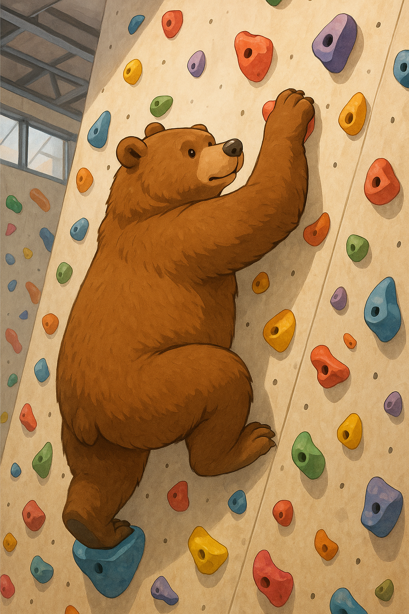

<h3>
    📈 저는 데이터를 분석하는 데 강하고,  "왜?"라는 질문으로 사고하는 개발자입니다 👩‍🚀
</h3>

### 🛝 Hobby

<table>
    <thead>
        <tr>
            <th>

</th>
            <th>

</th>
        </tr>
    </thead>
    <tbody>
        <tr>
            <td >
끈기와 열정 넘치는
</td>
            <td>
차분하지만 강한
</td>
        </tr>
    </tbody>
    
</table>

### 💻 Tech

### 🛠️ Tools

### ✉️ Contact

<!--
**kyun9-cloud/kyun9-cloud** is a ✨ _special_ ✨ repository because its `README.md` (this file) appears on your GitHub profile.

Here are some ideas to get you started:

- 🔭 I’m currently working on ...
- 🌱 I’m currently learning ...
- 👯 I’m looking to collaborate on ...
- 🤔 I’m looking for help with ...
- 💬 Ask me about ...
- 📫 How to reach me: ...
- 😄 Pronouns: ...
- ⚡ Fun fact: ...
-->

